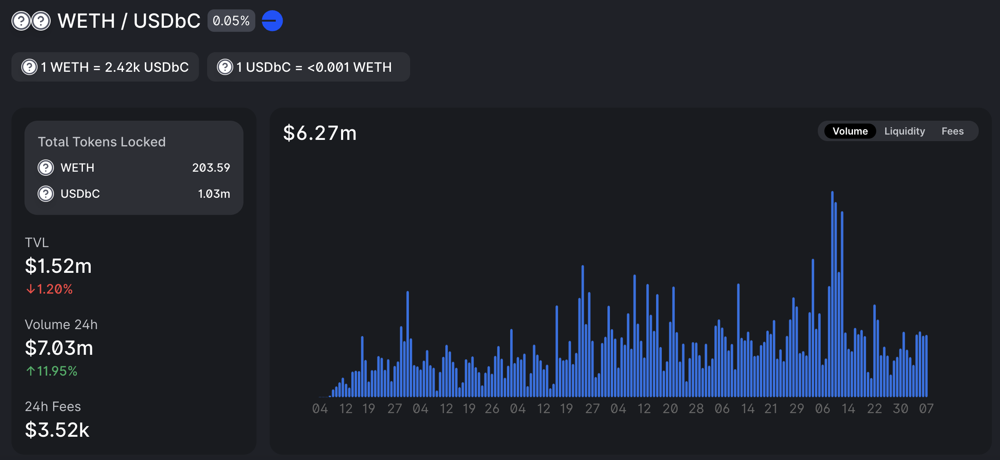
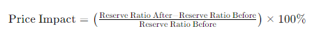
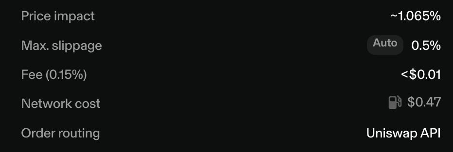
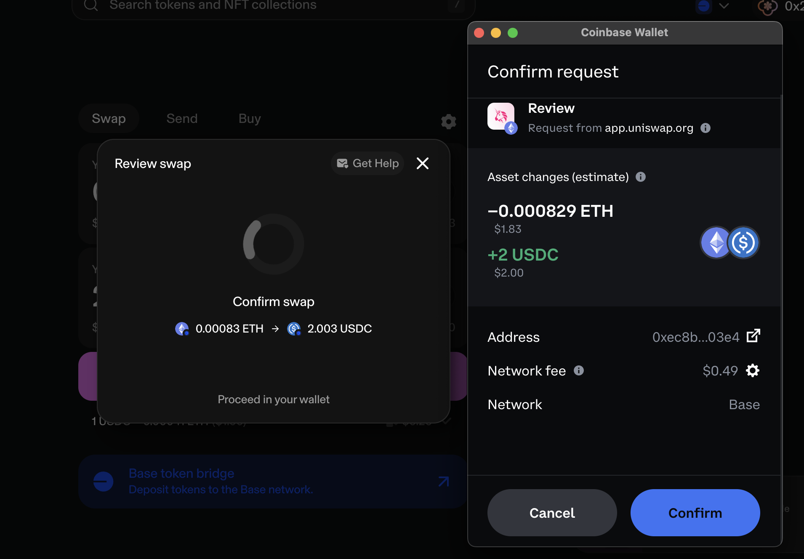
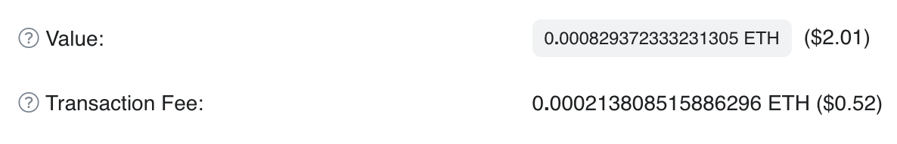
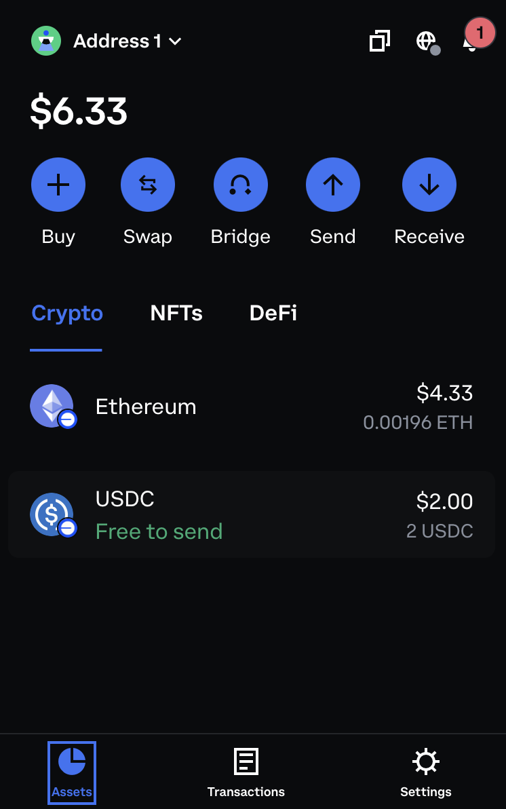
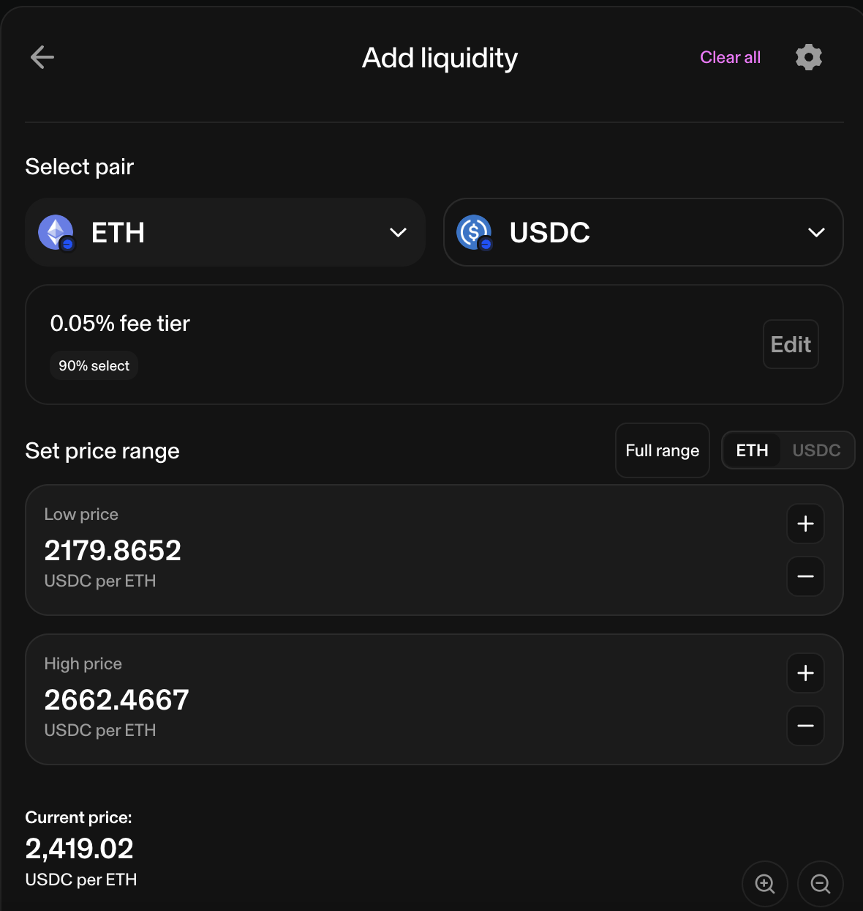
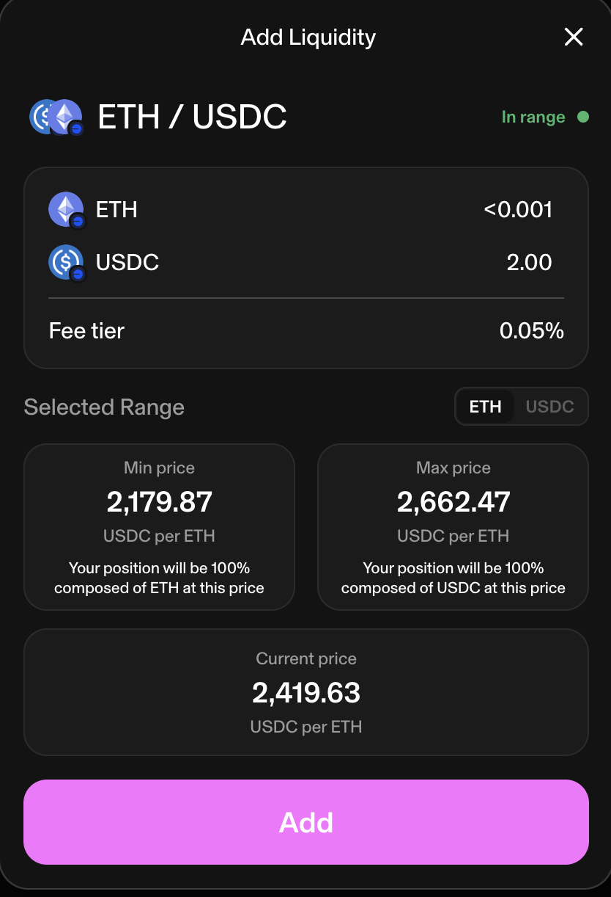

# DeFi-Fundamental-Analysis

 In this project for my UT Austin MSITM Financial Technology class I explore a few DeFi protocols, and then test the applicability of fundamental analysis in the DeFi lanscape.

 I will be testing and analyzing these platforms on the Base Ethereum L2 chain as it has cheaper gas fees and faster transaction times than the Ethereum L1 chain.

## 1. Uniswap - Price Impact, Swapping, & Liquidity

> 🔎 _See my analysis notebook here for reference: [**Uniswap Analysis**](uniswap.ipynb)_

Uniswap is a decentralized exchange (DEX) that allows users to swap various ERC-20 tokens. It is a popular platform for trading and providing liquidity to the DeFi ecosystem.

One of the key considerations when swapping tokens is the price impact of your trade. The price impact of a trade is essentially the impact of your trade on the market of the underlying asset pair. When you trade one asset for another, you're increasing the supply of one asset and decreasing the supply of the other. This can cause the price of the asset you're buying to increase and the price of the asset you're selling to decrease. It can also cause the inverse, which would present a profit on your trade, also called an "arbitrage." The weight of this impact is determined by the size of your trade relative to the size of the liquidity pool.

Conveniently, Uniswap and many other platforms already show this one the UI as it's a critical consideration in a swap trade, but it's still beneficial to understand why/how it works. It can be calculated as follows, using the WETH/USDbC pool as an example:



We can see that the WETH/USDbC pool currently has a rough valuation (TVL) of $1,520,000, where the reserves are ~203.59 WETH and ~1,030,000 USDC. 

Let's first say that we wanted to swap 200,000 USDbC for WETH. 

We would first calculate the reserve ratio of USDbC/WETH before the swap, which can be calculated as `USDbC_Reserves / WETH_Reserves = reserve_ratio`: 

```
1,030,000 / 203.59 = 5059.19
```

Given this ratio, we can then calculate the constant product, which is the product of the reserves of the pool, and should remain constant after the swap like so `USDbC_reserve_before * WETH_reserve_before = constant_product`:

```
1,030,000 * 203.59 = 209,697,700.0
```

### Price Impact Swapping 200,000 USDbC for WETH

To calculate the price impact of a 200,000 USDbC swap for WETH, given our previous reserve ratio and constant product, we will now need to calculate the reserves after our swap.

We can easily calculate how much USDbC will result in the reserves after the swap, where we add 200,000 to the pool as we are swapping for WETH by using `USDbC_reserve_before + 200000 = USDbC_reserve_after`:

```
1,030,000 + 200,000 = 1,230,000
```

We can then calculate the amount of WETH we will receive from the pool as `constant_product / USDbC_reserve_after = WETH_reserve_after`: 

```
209,697,700 / 1,230,000 = 170.5
```

Lastly, we need to use this value to calculate the reserve ratio after the swap, which can be calculated as `USDbC_Reserves_After / WETH_Reserves_After = reserve_ratio_after`:

```
1,230,000 / 170.5 = 7214.67
```

So at this point we have calculated the following:

- **USDbC Reserves Before**: 1,030,000
- **WETH Reserves Before**: 203.59
- **Reserve Ratio Before**: 5059.19
- **Constant Product**: 209,697,700

<br>

- **USDbC Reserves After**: 1,230,000
- **WETH Reserves After**: 170.5
- **Reserve Ratio After**: 7214.67

Using this information, we can calculate the price impact of our trade using:



```
((7214.67 - 5059.19) / 5059.19) * 100 = 42.6%
```

This value of **42.6%** is the **price impact** of our trade, which is a signifigant impact. This suggesdts that the price of WETH will increase by 42.6% after our trade, so we would essentially receive only `1 - 42.6% = 57.4%` of the value that we deposited. This is a good example of why it's important to consider the price impact of your trade before making a swap.

### Price Impact of Swapping 2 USDbC for WETH

Now that we've given an example of a significant trade, let's consider a smaller trade that will have a much lower price impact and effect on the liquidity pool.

We already have the following data from our previous example:

- **USDbC Reserves Before**: 1,030,000
- **WETH Reserves Before**: 203.59
- **Reserve Ratio Before**: 5059.19
- **Constant Product**: 209,697,700


Now we need to find the reserves and ratio after the swap.

We can calculate the USDbC reserves after the swap as `USDbC_Reserves_Before + 2 = USDbC_Reserves_After`:

```
1,030,000 + 2 = 1,030,002
```

We can then calculate the WETH reserves after the swap as `constant_product / USDbC_Reserves_After = WETH_Reserves_After`:

```
209,697,700 / 1,030,002 = 203.5896
```

Since the value of this transaction is so small, the difference in the WETH reserves from our swap is negligible. 

We can then calculate the reserve ratio after the swap as `USDbC_Reserves_After / WETH_Reserves_After = reserve_ratio_after`:

```
1,030,002 / 203.5896 = 5059.21
```

Using this information, we can calculate the price impact of our trade using:

```
((5059.21 - 5059.19) / 5059.19) * 100 = 0.0004%
```

As we can see, the **price impact** of this trade is **0.0004%**, which is essentially negligible. This is a good example of how the price impact of a trade can be significantly reduced by reducing the size of the trade relative to the size of the liquidity pool.

> ⚠️ _It's important to note that the reserves displayed on the Uniswap stats UI are rounded to 2 decimal places, so the values we calculated may not be precise enough as 2 decimal places in ETH isn't low enough to reflect such small transactions._

### Swap Demonstration

Now that we've explored the concept of price impact, let's demonstrate a swap on Uniswap. We will swap ETH for 2 USDC, and then check the reported price impact, fees, and actual amount of USDC received.

With the current pool selected, for a swap of ETH for 2 USDC, the price impact is report as just 1.065% since our transaction is so small. In addition to this price impact, we will be paying a protocol fee of <$0.01 and a network (gas) cost of $0.47.



In confirming the swap we can see that we are exchanging about 0.000829 ETH.



After the transaction was confirmed, we can see that I've received exactly 2 USDC into the wallet, which is what I expected. I paid a total of $0.52 in gas fees, and spent ~$2.01 in ETH to obtain the USDC. These values change always so there are discrepancies in the exact values between the different UIs.





## Liquidity Provision

In addition to swapping, Uniswap also allows users to provide liquidity to the platform. This is done by depositing an asset into one of the pools, and then receiving a share of the pool's fees in return.

To explore this I will be depositing the $2 of USDC that I just swapped for into the ETH/USDC pool.

I will be entering into the 0.05% fee pool, which means that I will receive a _share_ of the 0.05% fee on every swap that occurs in the pool. The low price and high prices of my positions are set to +/- 10% of the ETH price upon opening the position. If the USDC price of ETH falls outside of this range, my position will become inactive.



In depositing 2 USDC, I will have to deposit an equivalent amount of ETH to the pool. This is calculated as the current price of USDC in ETH, multiplied by the amount of USDC I'm depositing, which is 2. This results in a deposit of <0.001 ETH.



Once I have added the liquidity ([_txn reference_](https://basescan.org/tx/0x51cff6f83b2b9c614a47212827a9c8ec6c58460d6bda2f8ea5336bb9d9eba260)), I waited ...

## 2. Aave - Supplying & Borrowing


