# DeFi-Fundamental-Analysis

 In this project for my UT Austin MSITM Financial Technology class I explore a few DeFi protocols, and then test the applicability of fundamental analysis in the DeFi lanscape.

 I will be testing and analyzing these platforms on the Base Ethereum L2 chain as it has cheaper gas fees and faster transaction times than the Ethereum L1 chain.

## 1. Uniswap - Price Impact, Swapping, & Liquidity

> 🔎 _See my analysis notebook here for reference: [**Uniswap Analysis**](uniswap.ipynb)_

Uniswap is a decentralized exchange (DEX) that allows users to swap various ERC-20 tokens. It is a popular platform for trading and providing liquidity to the DeFi ecosystem.

One of the key considerations when swapping tokens is the price impact of your trade. The price impact of a trade is essentially the impact of your trade on the market of the underlying asset pair. When you trade one asset for another, you're increasing the supply of one asset and decreasing the supply of the other. This can cause the price of the asset you're buying to increase and the price of the asset you're selling to decrease. It can also cause the inverse, which would present a profit on your trade, also called an "arbitrage." The weight of this impact is determined by the size of your trade relative to the size of the liquidity pool.

Conveniently, Uniswap and many other platforms already show this one the UI as it's a critical consideration in a swap trade, but it's still beneficial to understand why/how it works. It can be calculated as follows, using the WETH/USDbC pool as an example:


We can see that the WETH/USDbC pool currently has a rough valuation (TVL) of $1,520,000, where the reserves are ~203.59 WETH and ~1,030,000 USDC. 

Let's first say that we wanted to swap 200,000 USDbC for WETH. 

We would first calculate the reserve ratio of USDbC/WETH before the swap, which can be calculated as `USDbC_Reserves / WETH_Reserves = reserve_ratio`: 

```
1,030,000 / 203.59 = 5059.19
```

Given this ratio, we can then calculate the constant product, which is the product of the reserves of the pool, and should remain constant after the swap like so `USDbC_reserve_before * WETH_reserve_before = constant_product`:

```
1,030,000 * 203.59 = 209,697,700.0
```

### Price Impact Swapping 200,000 USDbC for WETH

To calculate the price impact of a 200,000 USDbC swap for WETH, given our previous reserve ratio and constant product, we will now need to calculate the reserves after our swap.

We can easily calculate how much USDbC will result in the reserves after the swap, where we add 200,000 to the pool as we are swapping for WETH by using `USDbC_reserve_before + 200000 = USDbC_reserve_after`:

```
1,030,000 + 200,000 = 1,230,000
```

We can then calculate the amount of WETH we will receive from the pool as `constant_product / USDbC_reserve_after = WETH_reserve_after`: 

```
209,697,700 / 1,230,000 = 170.5
```

Lastly, we need to use this value to calculate the reserve ratio after the swap, which can be calculated as `USDbC_Reserves_After / WETH_Reserves_After = reserve_ratio_after`:

```
1,230,000 / 170.5 = 7214.67
```

So at this point we have calculated the following:

- **USDbC Reserves Before**: 1,030,000
- **WETH Reserves Before**: 203.59
- **Reserve Ratio Before**: 5059.19
- **Constant Product**: 209,697,700

<br>

- **USDbC Reserves After**: 1,230,000
- **WETH Reserves After**: 170.5
- **Reserve Ratio After**: 7214.67

Using this information, we can calculate the price impact of our trade using:


```
((7214.67 - 5059.19) / 5059.19) * 100 = 42.6%
```

This value of **42.6%** is the **price impact** of our trade, which is a signifigant impact. This suggesdts that the price of WETH will increase by 42.6% after our trade, so we would essentially receive only `1 - 42.6% = 57.4%` of the value that we deposited. This is a good example of why it's important to consider the price impact of your trade before making a swap.

### Price Impact of Swapping 2 USDbC for WETH

Now that we've given an example of a significant trade, let's consider a smaller trade that will have a much lower price impact and effect on the liquidity pool.

We already have the following data from our previous example:

- **USDbC Reserves Before**: 1,030,000
- **WETH Reserves Before**: 203.59
- **Reserve Ratio Before**: 5059.19
- **Constant Product**: 209,697,700


Now we need to find the reserves and ratio after the swap.

We can calculate the USDbC reserves after the swap as `USDbC_Reserves_Before + 2 = USDbC_Reserves_After`:

```
1,030,000 + 2 = 1,030,002
```

We can then calculate the WETH reserves after the swap as `constant_product / USDbC_Reserves_After = WETH_Reserves_After`:

```
209,697,700 / 1,030,002 = 203.5896
```

Since the value of this transaction is so small, the difference in the WETH reserves from our swap is negligible. 

We can then calculate the reserve ratio after the swap as `USDbC_Reserves_After / WETH_Reserves_After = reserve_ratio_after`:

```
1,030,002 / 203.5896 = 5059.21
```

Using this information, we can calculate the price impact of our trade using:

```
((5059.21 - 5059.19) / 5059.19) * 100 = 0.0004%
```

As we can see, the **price impact** of this trade is **0.0004%**, which is essentially negligible. This is a good example of how the price impact of a trade can be significantly reduced by reducing the size of the trade relative to the size of the liquidity pool.

> ⚠️ _It's important to note that the reserves displayed on the Uniswap stats UI are rounded to 2 decimal places, so the values we calculated may not be precise enough as 2 decimal places in ETH isn't low enough to reflect such small transactions._

### Swap Demonstration

Now that we've explored the concept of price impact, let's demonstrate a swap on Uniswap. We will swap ETH for 2 USDC, and then check the reported price impact, fees, and actual amount of USDC received.

With the current pool selected, for a swap of ETH for 2 USDC, the price impact is report as just 1.065% since our transaction is so small. In addition to this price impact, we will be paying a protocol fee of <$0.01 and a network (gas) cost of $0.47.


In confirming the swap we can see that we are exchanging about 0.000829 ETH.


After the transaction was confirmed, we can see that I've received exactly 2 USDC into the wallet, which is what I expected. I paid a total of $0.52 in gas fees, and spent ~$2.01 in ETH to obtain the USDC. These values change always so there are discrepancies in the exact values between the different UIs.


### Liquidity Provision

In addition to swapping, Uniswap also allows users to provide liquidity to the platform. This is done by depositing an asset into one of the pools, and then receiving a share of the pool's fees in return.

To explore this I will be depositing the $2 of USDC that I just swapped for into the ETH/USDC pool.

I will be entering into the 0.05% fee pool, which means that I will receive a _share_ of the 0.05% fee on every swap that occurs in the pool. The low price and high prices of my positions are set to +/- 10% of the ETH price upon opening the position. If the USDC price of ETH falls outside of this range, my position will become inactive.


In depositing 2 USDC, I will have to deposit an equivalent amount of ETH to the pool. This is calculated as the current price of USDC in ETH, multiplied by the amount of USDC I'm depositing, which is 2. This results in a deposit of <0.001 ETH.


Once I have added the liquidity ([_txn reference_](https://basescan.org/tx/0x51cff6f83b2b9c614a47212827a9c8ec6c58460d6bda2f8ea5336bb9d9eba260)), we can see from the blockscan that I have paid a transaction fee of $0.45, and I have received a claim to the deposit in the form of a Uniswap NFT. 

After waiting for about 11.5 hours, the results can be summarized as follows:

#### Initial Investment:

- **Initial Position Value:** $3.8297
- **Initial ETH Deposited:** 0.000756201762617597
- **Initial USDC Deposited:** 2.0

#### After Withdrawal:

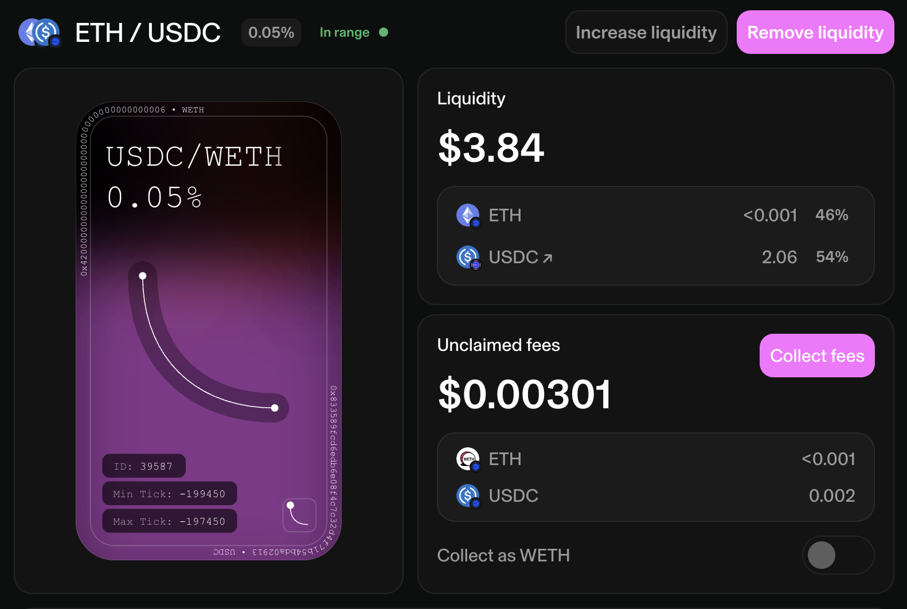

**Withdrawal Txn**: https://basescan.org/tx/0x02b60f1258eecbf84e7902b6e238456ed937b82b9a67445d68deb0af80cb66c7

- **Fees Yielded:** $0.00301
- **Amount of ETH Received:** 0.000731917631418648 (-3.2%) ($1.776 USD)
- **Amount of USDC Received:** $2.06187 (+3.1%)
- **Position PnL (Excl. Gas):** $3.83787 - $3.8297 = $0.00817

The fact that I received a different amount of ETH and USDC from my withdrawal is due to the fact that the price of ETH and USDC may have shifted during my investment, and my claim to each asset was shifted.

In conclusion, over the course of this trade I earned a total of $0.00301 in fees, and I gained $0.00817 overall. This is due to multiple factors, including the fact that the price of ETH and USDC may have shifted during my investment, and the fact that I was able to claim a share of the fees from the pool.

## 2. Aave - Supplying & Borrowing

Next I will be exploring Aave, a decentralized lending platform that allows users to supply assets to the platform and earn interest, or borrow assets from the platform and pay interest. Compared to traditional finance, this is essentially a decentralized version of a bank.

Before proceeding, it is beneficial to understand how the Aave protocol works, specifically the interest rate model for borrowing and lending that determines the rewards that users receive for supplying assets, and the costs that users pay for borrowing assets.

### Interest Rate Model Summary

Aave's interest rate model is the key mechanism that determines the interest rates that users pay for borrowing assets, and the interest rates that incentivises users to supply assets. The interest rate model is based on the **utilization rate** of the assets in the protocol, which is the ratio of the borrowed assets to the supplied assets.

To summarize the mathematical model:

* When capital is available (i.e. supply is high; the debt pool has low utilization): low interest rates to encourage borrowing.

* When capital is scarce (i.e. supply is low; the debt pool is highly utilized): high interest rates to encourage repayments of debt and additional supplying

Using the ETH lending pool as an example, we can see their interest rate model is configured as follows, where the current utilization rate is 60% but the target utilization rate is 80%, so rates are relatively low for what they could be:

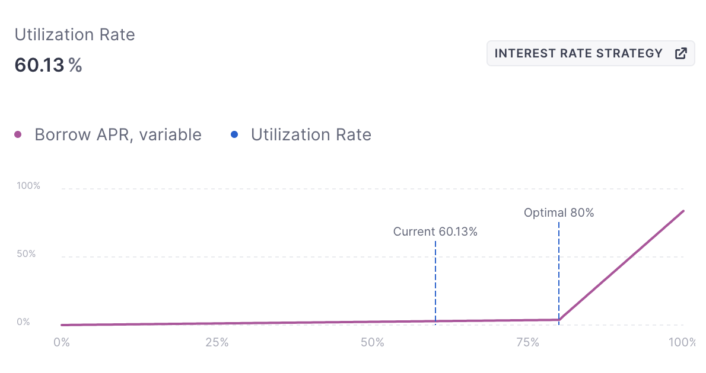

To see an example of the interest rate model in action, we can continue to use the ETH lending pool as an example to study its supply rate spike in October 2023. We can see that the rate shot up to 6.99% at its peak, moving far above the average rate of 1.42%.

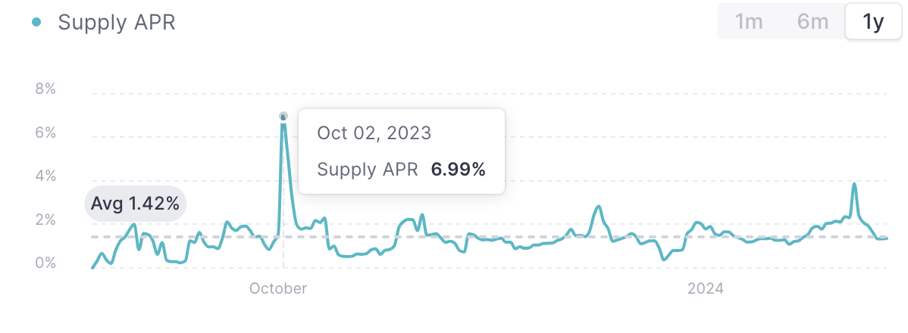

The supply APR rising to such high levels would mean that a significant amount of ETH was being borrowed, and the protocol was incentivising users to supply more ETH to the pool. 

We can confirm from the borrows APR chart that the borrow rate was also spiking at this time, which would have been a significant incentive for users to repay their loans and decrease the utilization rate of the pool.

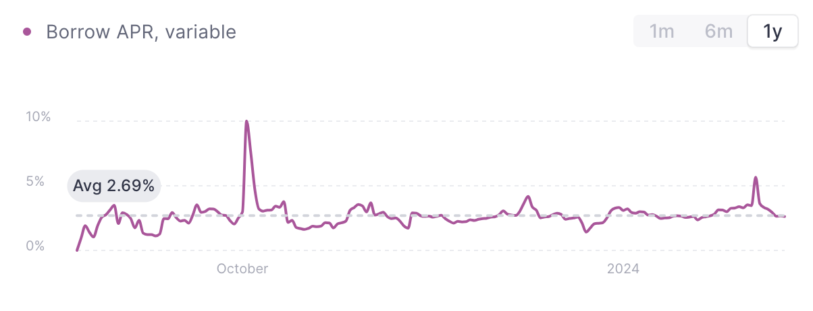

To read more about the model in-depth and understand the math behind it, see their documentation: https://docs.aave.com/risk/liquidity-risk/borrow-interest-rate

### Supply ETH & Borrow USDC

To test how the Aave platform works I will deposit some ETH, and then borrow USDC on that ETH stored as collateral.

In depositing $0.53 of ETH, I will be yielding 1.38% APY on my investment. It is important to note that this is a variable rate, and it may change over time as the supply of ETH (WETH) changes. 

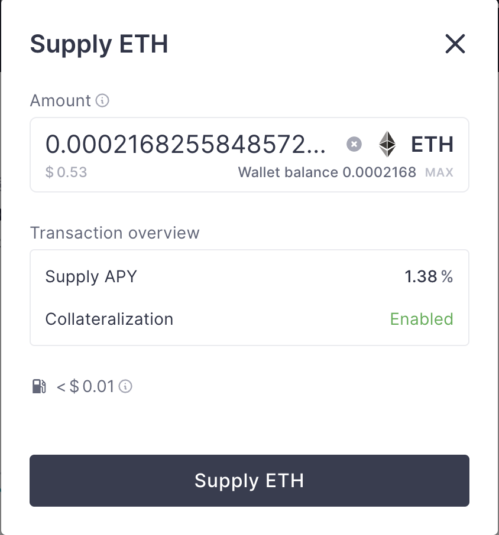

Once I have approved the supply transaction, we can see that I have received Aave V3 WETH tokens in return for my deposit. These tokens serve as a claim to my deposit, and can be used to withdraw my deposit at any time.

**Deposit Txn**: https://basescan.org/tx/0x141d8577cb44114857d399dd1ad2664e4d8e2113463c612d0cfe50a9cc7d0dd3

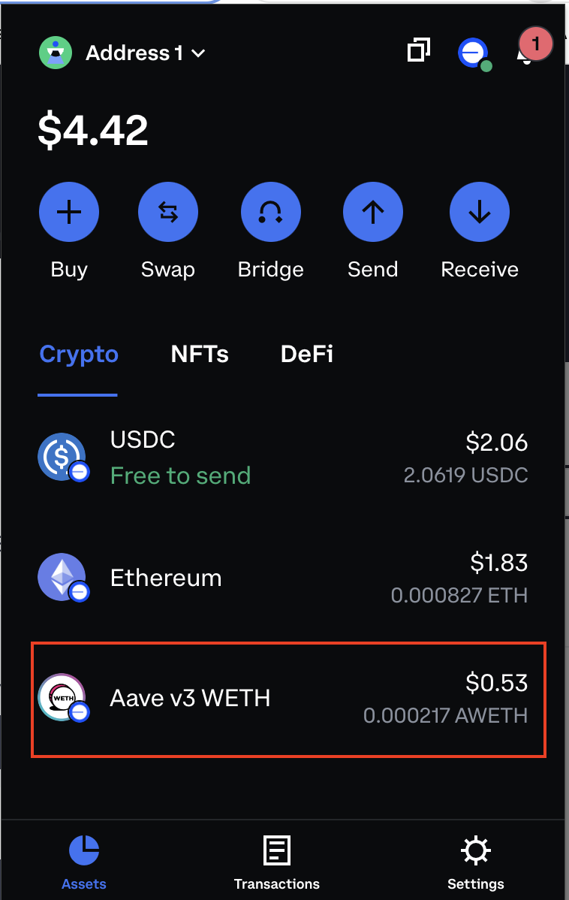

Now that I've supplied collateral in the form of ETH (WETH) I can take a partial loan on this collateral. I will be borrowing 50% of my collateral, which is 0.265 USDC. This loan will be charged at a 4.82% APY, which is a variable rate that may change over time, and means that we will accrue interest at a rate of 3.04% per year (as of the current rate) on our loan.

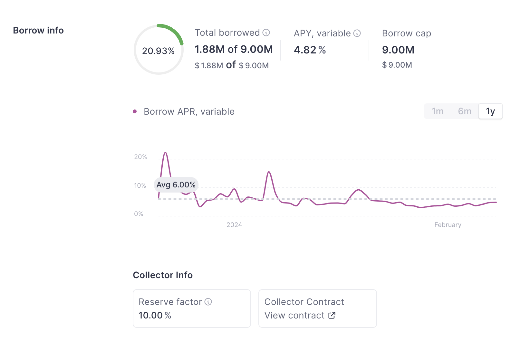

When we go to confirm the borrow transaction, we can see that there is a **health factor** metric. The health factor is a measure of the safety of your loan, and it is calculated as the ratio of your collateral to your loan. If your health factor falls below 1, your loan will be liquidated. The health factor changes based on the value of your collateral and the value of your loan, and it is important to monitor this value to ensure that your loan is safe.

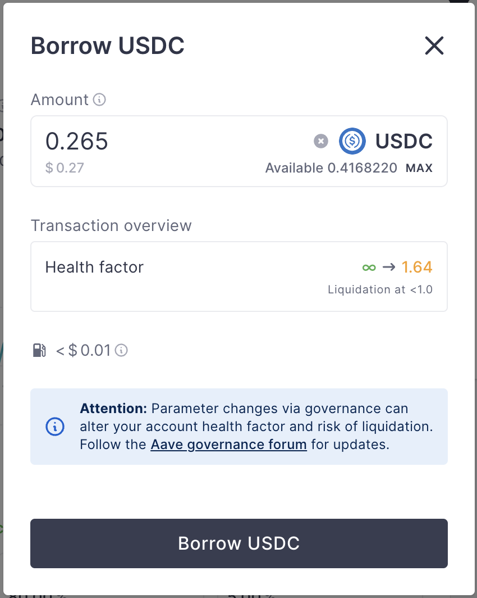

**Borrow Txn**: https://basescan.org/tx/0xb495d6b4a0633c8de37587d3bf0847544c2d4c0b5db69f54d8adf66995530aa6

Once I have approved the borrow transaction, we can see that I have received 0.265 USDC in return for my loan, as well as a debt token that represents the debt that I owe to the Aave protocol. 

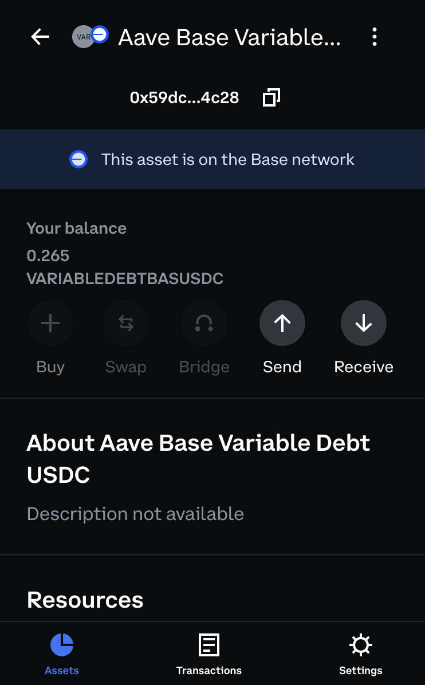

### Repay USDC & Withdraw ETH

After waiting about 6.5 hours, I have accrued a total of $0.00001 in interest on my loan. I initially borrowed exactly 0.265 USDC, and I now have an outstanding balance of 0.26501 USDC.

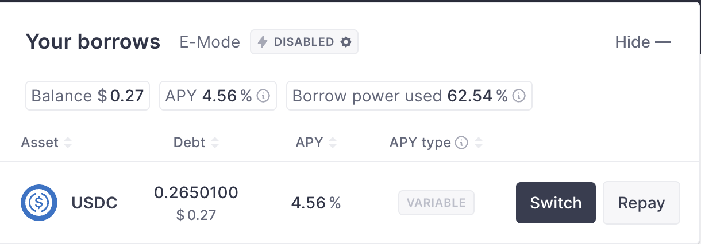

To repay this loan, I can use my WETH collateral. This will allow me to pay off the loan in full, and the debt token that I was issued will be burned.

I can see from the preview that repaying this loan will restore by health factor and nullify my borrow balance. My WETH staked as collateral will be chopped in half since I borrowed on 50% of it, but I have kept the USDC loan that I took since the WETH was used to repay instead of the USDC.

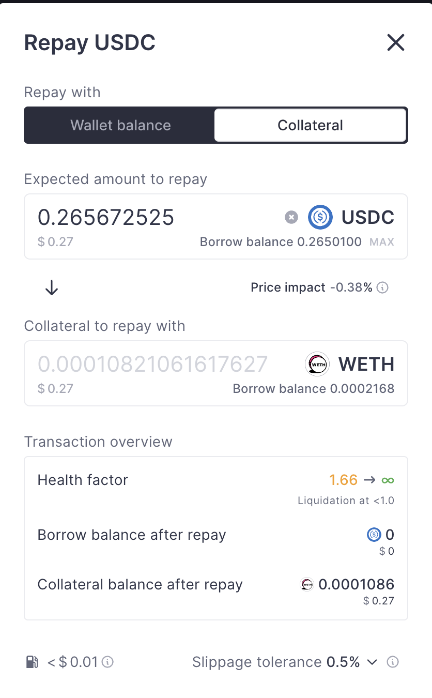

**Repay Txn**: https://basescan.org/tx/0xbd9c3ca108947c643a641d8b00a4d573b688c78569cf1fbc369451f47f57f2fe

Since I have repaid the loan and my health factor was restored, I can now withdraw all of my WETH remaining as collateral. 

**ETH Withdrawal Txn**: https://basescan.org/tx/0xcb5a90985e27e607d1da4fbb5c6bbf138620ce42d61127591432ddfdd209a9de

To summarize the results of this trade:

- **Initial Deposit (WETH):** 0.000216825584857269 ($0.53)
- **Initial Borrows (USDC):** $0.265
- **Interest Accrued (USDC):** $0.00001
- **Final Loan Payoff:** $0.26501
- **WETH Remaining (After Loan Payoff)**: 0.000108019088468248 (-0.00011)
- **USDC Remaning (After Loan Payoff)**: $0.26501 (+$0.26501)

I lost 0.000108806496389 ETH (because of the loan payoff with collateral) but I kept the USDC that I borrowed. So in the end I have about the same amount that I started with in total value (Excl. Gas Fees).

## DeFi Fundamental Analysis

Now that we've explored the functionality of Uniswap and Aave, we can begin to consider how we might apply fundamental analysis to these platforms.

WHAT IS THE STORY BEHIND THIS? WHY DO FUNDAMENTAL ANALYSIS AND WHAT CAN THIS BE COMPARED TO?